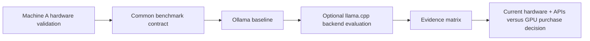

# Executive Proposal: Project FORGE — Local AI Compute & Hardware Lab

> **Author:** Francisco Ortiz - Software Architect
> **Date:** 2026-08-15
> **Status:** Completed — Phase 1 closed; procurement/API economics deferred
> **Version:** 1.0
> **Initiative ID:** 001  
> **Canonical Title:** Project FORGE — Local AI Compute & Hardware Lab

---

## 1. Executive Summary

This proposal establishes a practical, reproducible local large language model (LLM) inference laboratory on Machine A, the existing Windows desktop. The laboratory will measure real development usability, not peak benchmark scores, across NVIDIA CUDA and CPU/RAM-offload execution paths.

The primary decision is whether the current hardware plus selective cloud/API use is sufficient, or whether a future 24 GB/32 GB-class GPU should be purchased from Intel, NVIDIA, or AMD. The laboratory will begin by documenting and validating the installed hardware, then install and evaluate one runtime at a time. No corporate data, protected health information (PHI), secrets, or sensitive prompts are in scope.

Phase 1 used operator time and open-source software only. No GPU purchase is approved; future procurement remains out of scope until the deferred economic and technical decision gate is completed.

---

## 2. Background & Business Context

### 2.1 Current State (AS-IS)

Machine A hardware, runtimes, model configurations, telemetry, and performance measurements were captured through the completed POC. The evidence is bounded to the tested desktop, model quantizations, prompts, contexts, and runtime versions; it does not predict untested hardware or API cost.

| Machine | Known configuration | Intended role |
| --- | --- | --- |
| Machine A — Personal Desktop | Intel Core i7-12700KF; NVIDIA RTX 3070 8 GB; 32 GB DDR4-2666; Windows; Ollama installed | Consumer NVIDIA 8 GB CUDA baseline |

### 2.2 Future State (TO-BE)

The completed evidence set contains comparable Machine A results for the selected models and runtimes, including prefill and generation performance, memory behavior, GPU offload, and subjective usability. It supports retaining current hardware and deferring a discrete-GPU purchase; the local-versus-API cost boundary remains a separate decision.

---

## 3. Strategic Alignment

| Strategic Goal | How This Proposal Aligns |
| --- | --- |
| Data-driven local AI platform decisions | Replaces hardware speculation with repeatable, recorded observations. |
| Practical AI development capability | Measures interactive development experience, not only tokens per second. |
| Cost discipline | Compares a potential GPU purchase against existing hardware and API usage. |
| Secure experimentation | Excludes corporate data, PHI, secrets, and sensitive information from all prompts and evidence. |

---

## 4. Proposed Solution

Create a controlled local inference laboratory with a common workload, structured capture sheet, and staged runtime installation. Stage 1 validates Machine A hardware and operating constraints. Subsequent stages establish an Ollama baseline, then evaluate `llama.cpp` only if it adds required observability or backend coverage.

The initial model path is intentionally limited: Machine A will later use Qwen3 14B Q4_K_M as its declared baseline. A small, large, and very-large model ladder will be selected after hardware validation and current model availability review. No model results are assumed by this proposal.

### Measurement Contract

Every accepted result will record: model, quantization, machine, backend, model size, system RAM, VRAM, load time, prompt processing tokens/second, generation tokens/second, context size, GPU offload/layers, CPU and GPU utilization, and notes. The approved benchmark prompt will be used for directly comparable runs. Prefill and generation must remain distinct fields.

---

## 5. Options Considered

| Option | Description | Pros | Cons | Estimated Cost |
| --- | --- | --- | --- | --- |
| A | Use existing hardware plus APIs when local capacity is inadequate | No capital purchase; immediate | Local model size and privacy/offline capacity remain constrained | API usage: TBD |
| B | Upgrade desktop system RAM to 64 GB and retain existing GPUs | Increases CPU/RAM offload and 70B feasibility exploration | Does not increase VRAM; may still be too slow for practical use | Hardware price: TBD |
| C | Purchase an Intel Arc Pro, NVIDIA RTX, or AMD Radeon/Pro 24 GB/32 GB-class GPU after the lab | Potentially enables larger local models and reduces offload | Purchase cost, compatibility, power, runtime support, and real-world performance remain unverified | Hardware price: TBD |

**Recommended Option:** Run the staged laboratory first; defer Options B and C until results are reviewed.

---

## 6. Cost Analysis

| Category | Year 1 | Year 2 | Year 3 | Total |
| --- | --- | --- | --- | --- |
| Development / operator time | TBD | TBD | TBD | TBD |
| Infrastructure / Cloud APIs | TBD | TBD | TBD | TBD |
| Licensing / SaaS | $0 planned | $0 planned | $0 planned | $0 planned |
| Hardware upgrades | Deferred | TBD | TBD | TBD |
| Personnel | Included in operator time | TBD | TBD | TBD |
| Training & Change Mgmt | $0 planned | $0 planned | $0 planned | $0 planned |
| Contingency (15%) | TBD | TBD | TBD | TBD |
| **Total** | **TBD** | **TBD** | **TBD** | **TBD** |

### Cost Assumptions

- The initial lab uses free/open-source software where practical.
- Current market pricing and availability for any candidate Intel, NVIDIA, or AMD GPU will be researched only when a purchase decision is in scope.

---

## 7. Timeline & Milestones

| Milestone | Description | Target Date | Deliverable |
| --- | --- | --- | --- |
| M1 | Define laboratory and validate hardware constraints | Complete | Verified Machine A inventory and evidence matrix |
| M2 | Establish reproducible Ollama baseline | Complete | Qwen3 8B/14B/32B baseline results |
| M3 | Evaluate additional approved runtime/backend paths | Complete | llama.cpp/CUDA and peer-model comparisons |
| M4 | Review model-size/context/offload findings | Complete | Consolidated Machine A findings |
| M5 | Decide current hardware posture | Complete | Retain current hardware; procurement and API economics deferred |

---

## 8. Risk Assessment

| Risk | Probability | Impact | Severity | Mitigation Strategy |
| --- | --- | --- | --- | --- |
| Corporate, PHI, secrets, or sensitive information is used in a test | M | H | 🔴 | Use only synthetic, public, or personally authored non-sensitive prompts; store no sensitive evidence. |
| Thermal or power limits distort desktop results | M | M | 🟢 | Record power mode and observed throttling; compare only like-for-like runs. |
| Results are not reproducible across runs | M | M | 🟢 | Version prompt, runtime, model file/quantization, context size, and run settings. |
| A GPU purchase is recommended from incomplete evidence | L | H | 🟡 | Require the agreed model ladder, practical-usability ratings, and cost comparison before recommendation. |

---

## 9. Resource Requirements

| Role / Resource | Quantity | Duration | Cost |
| --- | --- | --- | --- |
| Lab operator | 1 | Staged, user-directed | TBD |
| Personal desktop | 1 | Existing | $0 incremental |
| Open-source runtimes | As approved per stage | Per test | $0 planned |

---

## 10. Expected Benefits

| Benefit | Type | Metric | Target | Timeline |
| --- | --- | --- | --- | --- |
| Evidence-based hardware decision | Efficiency | Complete comparable result matrix | All approved paths recorded | Before any purchase |
| Practical local model guidance | Capability | Usability rating by model tier and machine | Clear supported/comfortable limits | After baseline stages |
| Reduced tool-selection uncertainty | Cost / Efficiency | Runtime and backend decision rationale | One default baseline runtime | After runtime evaluation |

### ROI Summary

| Metric | Value |
| --- | --- |
| Total Investment | TBD — no purchase authorized |
| Expected Annual Benefit | TBD from observed local use and avoided API usage |
| Payback Period | TBD |
| 3-Year ROI | TBD |

---

## 11. Recommendation

**Final recommendation:** Retain Machine A and use Qwen3 8B or Llama 3.1 8B for supervised local drafting. Do not approve a GPU purchase. Qwen3 14B is usable but slow, and Qwen3 32B is not suitable for interactive work on the RTX 3070 8 GB. The evaluated models are not approved for autonomous Azure/C# architecture, implementation, test, review, or deployment decisions.

### Next Steps

1. Define one representative workload and its monthly local/API usage profile.
2. If procurement is reconsidered, verify current candidate price, desktop compatibility, Windows runtime support, and measured 8B/32B performance before a new decision.

---

## 12. Decision

| Decision | Approver | Signature | Date |
| --- | --- | --- | --- |
| ✅ Complete — retain current hardware; defer procurement/API economics | Francisco Ortiz | Recorded in ADR-001 and POC results | 2026-08-15 |

### Conditions (if applicable)

- No corporate data, PHI, secrets, credentials, private source code, or sensitive prompts may be used.
- The operator runs commands and provides output; this proposal must distinguish reported facts from measured evidence.
- Hardware acquisition remains out of scope until the deferred decision gate is completed.

---

## 13. Appendix

### 13.1 Acronyms

| Acronym | Definition |
| --- | --- |
| API | Application Programming Interface |
| CUDA | NVIDIA parallel computing platform and programming model |
| GGUF | Model file format commonly used by `llama.cpp`-compatible runtimes |
| LLM | Large Language Model |
| POC | Proof of Concept |
| VRAM | Video Random Access Memory |

### 13.2 Reference Documents

| Document | Location |
| --- | --- |
| User-provided machine inventory and laboratory objectives | Conversation, 2026-08-15 |
| Current-state index | Unavailable in this workspace |

---

*Template version 1.0 — Francisco Ortiz - Software Architect*
