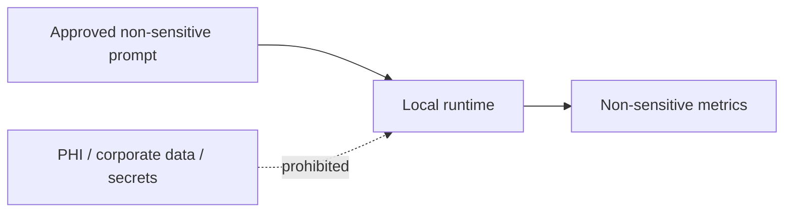

# Regulatory Map: Project FORGE — Local AI Compute & Hardware Lab

> **Initiative:** 001-project-forge-local-ai-compute-hardware-lab  
> **ADR Reference:** `knowledge-base/adrs/001-project-forge-local-ai-compute-hardware-lab.md`

| Data / Component | HIPAA | SOC 2 | POC Rule | Evidence |
| --- | --- | --- | --- | --- |
| Synthetic/public benchmark prompt | Not PHI | Non-sensitive | Allowed | Prompt version |
| Corporate data, PHI, secrets, private code | Potentially regulated/restricted | Confidential | Prohibited | Operator attestation |
| Model/runtime binaries | Not PHI | Supply-chain concern | Approved source/version required | Source/version record |
| Performance result record | Non-sensitive by design | Confidentiality hygiene | No secrets or sensitive paths | Result review |

