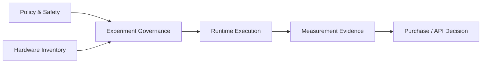

# Domain Glossary: Project FORGE — Local AI Compute & Hardware Lab

> **Initiative:** 001-project-forge-local-ai-compute-hardware-lab  
> **Status:** Reviewed — evidence pending  
> **ADR Reference:** `knowledge-base/adrs/001-project-forge-local-ai-compute-hardware-lab.md`

## Scope and Assumptions

Current-state documentation is unavailable. This glossary derives only from the approved proposal and user-supplied inventory; it does not assert installed software behavior or measured hardware capability.

| Term | Definition | Synonyms / Mapping | Context | Status |
| --- | --- | --- | --- | --- |
| Benchmark run | One recorded execution using an immutable workload configuration | Trial | Measurement | Defined |
| Prefill | Processing supplied prompt/context tokens before generation | Prompt processing | Measurement | Defined |
| Generation | Autoregressive production of output tokens | Decode | Measurement | Defined |
| GPU offload | Portion of model execution placed on a GPU backend | GPU layers | Runtime | Defined |
| Practical usability | Human rating: excellent, usable, tolerable, or too slow | Developer experience | Decision | Defined |
| Evidence record | Immutable run configuration plus observed metrics and notes | Result row | Governance | Defined |
| Sensitive data | Corporate data, PHI, secrets, credentials, private code, or other restricted information | Prohibited test input | Security | Defined |
| Model ladder | Selected small, medium, large, and optionally very-large representative models | Test set | Measurement | Pending selection |

## Bounded Context Map

| Context | Type | Responsibility | Relationship |
| --- | --- | --- | --- |
| Experiment Governance | Core | Defines comparable runs, evidence, and gates | Governs every other context |
| Hardware Inventory | Supporting | Captures verified machine capabilities | Supplies constraints |
| Runtime Execution | Supporting | Runs approved local software/model combinations | Produces measurements |
| Policy & Safety | Supporting | Controls data classification and safe execution | Can block execution |
| Decision | Core | Chooses current hardware/API path or upgrade | Consumes evidence |

## Findings

- 🟡 A benchmark run must not be compared unless its prompt, context size, runtime/backend, model revision/quantization, and power state are recorded.
- 🟡 “VRAM” and “shared graphics memory” are distinct fields; they must not be combined or treated as equivalent capacity.
- 🟢 The model ladder is pending and must be selected before performance claims are made.
