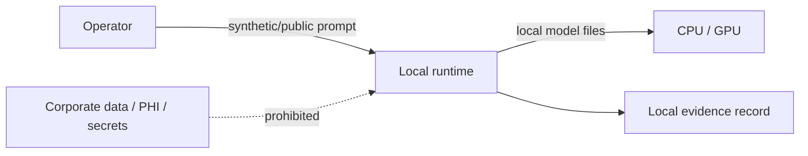

# Threat Model: Project FORGE — Local AI Compute & Hardware Lab

> **Initiative:** 001-project-forge-local-ai-compute-hardware-lab  
> **Status:** Conditional approval for non-sensitive POC only  
> **ADR Reference:** `knowledge-base/adrs/001-project-forge-local-ai-compute-hardware-lab.md`

## Data Flow and Trust Boundaries

Assets: device integrity, model binaries, benchmark prompts, and result records. No regulated data is authorized.

| ID | STRIDE | Threat | Likelihood | Impact | Severity | Mitigation / Status |
| --- | --- | --- | --- | --- | --- | --- |
| TM-001 | Information Disclosure | Sensitive prompts, PHI, secrets, or private code are submitted to a local or API-connected runtime. | M | H | 🔴 | Blocked by BR-001; use approved synthetic/public inputs only. |
| TM-002 | Tampering | Untrusted model/runtime download is executed. | M | H | 🟡 | Download only from approved sources; record version/hash where available; review provenance. |
| TM-003 | Elevation of Privilege | Runtime installer gains unnecessary administrative rights. | M | H | 🟡 | Use least privilege; do not bypass endpoint controls. |
| TM-004 | Denial of Service | Sustained inference causes thermal, power, or resource impact on the desktop. | M | M | 🟢 | Use bounded runs, observe thermals, and stop on system warning. |
| TM-005 | Repudiation | Results cannot be attributed to a configuration. | M | M | 🟢 | Use complete evidence records under BR-003. |
| TM-006 | Spoofing | Misidentified backend/device leads to false conclusions. | M | M | 🟢 | Capture runtime logs and read-only hardware inventory. |

## Residual Risk

Residual risk is **medium** for a non-sensitive, local-only POC after TM-001 through TM-003 controls are met. Any use of restricted corporate data is outside scope and blocks the POC.
